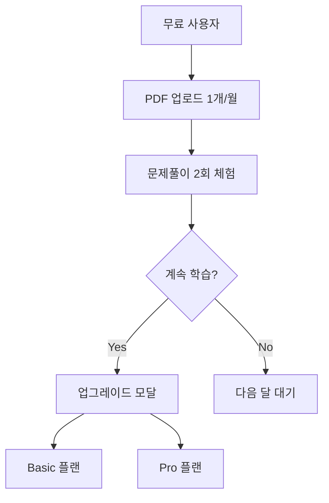

# 무료 체험 제한 시스템 구현 가이드

## 📋 개요

무료 사용자에게 PDF 분석 후 **2회 문제풀이 체험**을 제공하는 제한 시스템입니다.

## 🎯 핵심 기능

### 무료 플랜 제한사항
- ✅ PDF 업로드: **1개/월**
- ✅ 문제풀이 세션: **2회/PDF**
- ✅ 2회 사용 후 → 유료 업그레이드 유도

### 유료 플랜
- **자격증별 구독**: 10,000원 (시험일까지 무제한)
  - 무제한 문제풀이 및 모의고사
  - AI 기반 취약점 분석 및 맞춤 학습
  - 합격 예측 및 학습 진도 관리
  - 시험일까지 모든 기능 무제한 이용
  - 선택한 시험 날짜까지 구독 유지

## 🗄️ 데이터베이스 스키마

### 1. `study_sets` 테이블 (확장)
```sql
ALTER TABLE study_sets
ADD COLUMN is_free_trial BOOLEAN DEFAULT true,
ADD COLUMN practice_sessions_used INTEGER DEFAULT 0;
```

- `is_free_trial`: 무료 체험 여부
- `practice_sessions_used`: 사용한 세션 횟수

### 2. `practice_sessions` 테이블 (신규)
```sql
CREATE TABLE practice_sessions (
    id UUID PRIMARY KEY,
    study_set_id UUID REFERENCES study_sets(id),
    clerk_user_id TEXT NOT NULL,
    session_type TEXT CHECK (session_type IN ('practice', 'mock_exam')),
    questions_attempted INTEGER DEFAULT 0,
    questions_correct INTEGER DEFAULT 0,
    started_at TIMESTAMPTZ,
    completed_at TIMESTAMPTZ,
    time_spent_seconds INTEGER,
    created_at TIMESTAMPTZ
);
```

- 각 문제풀이 세션 기록
- 진행 상황 및 결과 추적

### 3. `user_limits` 테이블 (신규)
```sql
CREATE TABLE user_limits (
    id UUID PRIMARY KEY,
    clerk_user_id TEXT UNIQUE NOT NULL,
    subscription_tier TEXT DEFAULT 'free',
    max_pdfs_per_month INTEGER DEFAULT 1,
    max_practice_sessions_per_pdf INTEGER DEFAULT 2,
    current_month_pdfs_uploaded INTEGER DEFAULT 0,
    subscription_start_date TIMESTAMPTZ,
    subscription_end_date TIMESTAMPTZ
);
```

- 사용자별 구독 상태 및 제한
- 월별 사용량 추적

## 🔧 백엔드 API

### 1. 사용자 제한 조회
```http
GET /api/v1/trial/limits
Authorization: Bearer {clerk_token}
```

**응답:**
```json
{
  "subscription_tier": "free",
  "max_pdfs_per_month": 1,
  "max_practice_sessions_per_pdf": 2,
  "current_month_pdfs_uploaded": 0,
  "can_upload_pdf": true
}
```

### 2. 문제집 체험 상태 조회
```http
GET /api/v1/trial/study-sets/{study_set_id}/trial-status
```

**응답:**
```json
{
  "study_set_id": "uuid",
  "is_free_trial": true,
  "practice_sessions_used": 1,
  "practice_sessions_remaining": 1,
  "can_start_session": true,
  "requires_upgrade": false
}
```

### 3. 문제풀이 세션 시작
```http
POST /api/v1/trial/sessions
Content-Type: application/json

{
  "study_set_id": "uuid",
  "session_type": "practice"
}
```

**성공 응답 (201):**
```json
{
  "id": "session_uuid",
  "study_set_id": "uuid",
  "session_type": "practice",
  "started_at": "2024-01-15T10:00:00Z"
}
```

**제한 초과 응답 (402 Payment Required):**
```json
{
  "detail": "무료 체험 2회를 모두 사용했습니다...",
  "trial_status": {
    "practice_sessions_used": 2,
    "practice_sessions_remaining": 0,
    "requires_upgrade": true
  },
  "upgrade_url": "/pricing"
}
```

### 4. 세션 완료
```http
PATCH /api/v1/trial/sessions/{session_id}/complete

{
  "questions_attempted": 25,
  "questions_correct": 20,
  "time_spent_seconds": 1800
}
```

## 💻 프론트엔드 구현 예시

### 1. 문제풀이 시작 전 체험 상태 확인
```typescript
// frontend/src/hooks/useTrialStatus.ts
export function useTrialStatus(studySetId: string) {
  return useQuery({
    queryKey: ['trial-status', studySetId],
    queryFn: async () => {
      const response = await fetch(
        `${API_URL}/v1/trial/study-sets/${studySetId}/trial-status`,
        {
          headers: {
            Authorization: `Bearer ${await getToken()}`,
          },
        }
      );
      return response.json();
    },
  });
}
```

### 2. 문제풀이 시작 (제한 체크 포함)
```typescript
// frontend/src/components/study/StartPracticeButton.tsx
export function StartPracticeButton({ studySetId }: Props) {
  const { data: trialStatus } = useTrialStatus(studySetId);
  const [showUpgradeModal, setShowUpgradeModal] = useState(false);

  const startSession = async () => {
    try {
      const response = await fetch(`${API_URL}/v1/trial/sessions`, {
        method: 'POST',
        headers: {
          'Content-Type': 'application/json',
          Authorization: `Bearer ${await getToken()}`,
        },
        body: JSON.stringify({
          study_set_id: studySetId,
          session_type: 'practice',
        }),
      });

      if (response.status === 402) {
        // 무료 체험 제한 초과
        setShowUpgradeModal(true);
        return;
      }

      const session = await response.json();
      // 문제풀이 페이지로 이동
      router.push(`/practice/${session.id}`);
    } catch (error) {
      toast.error('세션 시작 실패');
    }
  };

  return (
    <>
      <button onClick={startSession}>
        문제풀이 시작
        {trialStatus?.practice_sessions_remaining && (
          <span className="text-sm">
            (남은 횟수: {trialStatus.practice_sessions_remaining})
          </span>
        )}
      </button>

      {showUpgradeModal && (
        <UpgradeModal onClose={() => setShowUpgradeModal(false)} />
      )}
    </>
  );
}
```

### 3. 업그레이드 모달
```typescript
// frontend/src/components/modals/UpgradeModal.tsx
export function UpgradeModal({ onClose }: Props) {
  return (
    <Modal>
      <div className="p-6">
        <h2 className="text-2xl font-bold mb-4">
          🎓 무료 체험이 종료되었습니다
        </h2>
        <p className="text-gray-600 mb-6">
          PDF 분석 후 2회 문제풀이를 모두 사용했습니다.
          <br />
          유료 플랜으로 업그레이드하여 무제한으로 학습하세요!
        </p>

        <div className="bg-gradient-to-r from-blue-50 to-purple-50 p-6 rounded-lg border-2 border-blue-200 mb-6">
          <div className="flex items-center justify-between mb-4">
            <div>
              <p className="text-sm text-gray-600">자격증별 구독</p>
              <h3 className="text-3xl font-bold text-blue-600">₩10,000</h3>
            </div>
            <span className="bg-blue-600 text-white px-3 py-1 rounded-full text-sm font-semibold">
              시험일까지 무제한
            </span>
          </div>

          <ul className="space-y-2">
            {[
              '무제한 문제풀이 및 모의고사',
              'AI 기반 취약점 분석',
              '합격 예측 및 학습 진도 관리',
              '시험일까지 모든 기능 이용',
            ].map((feature, i) => (
              <li key={i} className="flex items-center gap-2">
                <Check className="w-4 h-4 text-blue-600" />
                <span className="text-gray-700">{feature}</span>
              </li>
            ))}
          </ul>
        </div>

        <div className="flex gap-4">
          <button onClick={onClose}>나중에</button>
          <Link href="/pricing">
            <button className="bg-blue-600 text-white">
              플랜 선택하기 →
            </button>
          </Link>
        </div>
      </div>
    </Modal>
  );
}
```

## 🚀 배포 체크리스트

### 1. Supabase 설정
- [ ] `005_add_free_trial_limits.sql` 실행
- [ ] RLS 정책 확인
- [ ] 인덱스 생성 확인

### 2. 백엔드 배포
- [ ] `/api/v1/trial` 엔드포인트 테스트
- [ ] 함수 `can_start_practice_session()` 동작 확인
- [ ] 함수 `increment_practice_session()` 동작 확인

### 3. 프론트엔드 배포
- [ ] 체험 상태 표시 UI 구현
- [ ] 업그레이드 모달 구현
- [ ] 가격 페이지 업데이트

### 4. 테스트 시나리오
1. **무료 사용자 첫 세션**
   - PDF 업로드 → 분석 완료
   - 문제풀이 시작 (1/2)
   - 정상 진행 확인

2. **무료 사용자 두 번째 세션**
   - 문제풀이 시작 (2/2)
   - 정상 진행 확인
   - "남은 횟수: 0" 표시 확인

3. **무료 사용자 제한 초과**
   - 문제풀이 시작 시도
   - 402 에러 및 업그레이드 모달 표시
   - 가격 페이지 링크 동작 확인

4. **유료 사용자**
   - 무제한 세션 시작 가능 확인
   - 제한 표시 없음 확인

## 📊 추적 메트릭

### 주요 KPI
- 무료 → 유료 전환율
- 평균 체험 세션 수
- 업그레이드 모달 노출 후 전환율
- 첫 PDF 업로드 후 유료 전환까지 시간

### 모니터링 쿼리
```sql
-- 일별 체험 제한 도달 사용자 수
SELECT
  DATE(created_at) as date,
  COUNT(DISTINCT clerk_user_id) as users_hit_limit
FROM practice_sessions ps
JOIN study_sets ss ON ps.study_set_id = ss.id
WHERE ss.practice_sessions_used >= 2
  AND ss.is_free_trial = true
GROUP BY DATE(created_at);

-- 전환율 분석
SELECT
  ul.subscription_tier,
  COUNT(*) as user_count,
  AVG(ss.practice_sessions_used) as avg_sessions
FROM user_limits ul
LEFT JOIN study_sets ss ON ul.clerk_user_id = ss.clerk_user_id
GROUP BY ul.subscription_tier;
```

## 🔄 업그레이드 경로



## 💡 구현 팁

1. **점진적 기능 잠금**
   - 1회차: 모든 기능 사용 가능
   - 2회차: AI 분석 미리보기만
   - 3회차 시도: 업그레이드 필수

2. **사용자 경험 최적화**
   - 남은 횟수를 항상 표시
   - 첫 세션부터 업그레이드 가치 강조
   - 제한 도달 시 부드러운 전환

3. **프로모션 활용**
   - 신규 가입자: 첫 달 50% 할인
   - 체험 만료 전: 1회 추가 제공 이벤트
   - 친구 초대: 양쪽 모두 보너스 세션

이 구현으로 무료 사용자에게 가치를 체험하게 하면서, 유료 전환을 유도할 수 있습니다!
