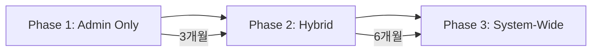

# MLflow 적용 범위 비교: Admin Only vs System-Wide

## 1. 아키텍처 차이점

### 🔐 Admin Only (관리자 전용)
```
┌─────────────────────────┐
│   일반 사용자 (Frontend) │
│   - 학습 기능만 사용     │
│   - MLflow 미노출       │
└────────────┬────────────┘
             │
┌────────────▼────────────┐
│      Backend API        │
│   - 모델 서빙만         │
│   - 추론 API           │
└────────────┬────────────┘
             │
┌────────────▼────────────┐     ┌──────────────────┐
│   Production Models     │     │  Admin Dashboard  │
│   (고정 버전)           │◄────│  - MLflow UI     │
└─────────────────────────┘     │  - 실험 관리      │
                                │  - 모델 배포      │
                                └──────┬───────────┘
                                       │
                                ┌──────▼───────────┐
                                │   MLflow Server  │
                                │  (Admin 전용)    │
                                └──────────────────┘
```

### 🌐 System-Wide (전체 시스템)
```
┌─────────────────────────┐
│   일반 사용자 (Frontend) │
│   - 개인화된 모델       │
│   - 학습 기록 추적      │
└────────────┬────────────┘
             │
┌────────────▼────────────┐
│      Backend API        │
│   - 사용자별 실험       │
│   - 실시간 학습         │
│   - MLflow 통합         │
└────────────┬────────────┘
             │
┌────────────▼────────────┐
│    MLflow Server        │
│  - 모든 사용자 추적     │
│  - 개인화 모델 저장     │
└─────────────────────────┘
```

## 2. 기능 범위 비교

| 구분 | Admin Only | System-Wide |
|------|------------|-------------|
| **모델 학습 추적** | 관리자만 | 모든 사용자 |
| **실험 관리** | 중앙 집중식 | 분산형 |
| **모델 배포** | 관리자 승인 | 자동화 가능 |
| **성능 모니터링** | 전체 통계 | 개인별 + 전체 |
| **A/B 테스트** | 시스템 레벨 | 사용자 레벨 가능 |
| **데이터 수집** | 집계된 데이터 | 상세 개인 데이터 |

## 3. Admin Only 방식의 장단점

### ✅ 장점
```yaml
보안:
  - MLflow 접근 제한으로 보안 강화
  - 민감한 모델 정보 보호
  - 사용자 데이터 격리

비용:
  - 인프라 비용 절감 (단일 MLflow 서버)
  - 스토리지 최적화
  - 관리 오버헤드 감소

관리:
  - 중앙 집중식 모델 관리
  - 일관된 모델 품질 보장
  - 배포 프로세스 표준화

성능:
  - 프로덕션 모델 최적화 집중
  - 리소스 효율적 사용
  - 빠른 추론 속도
```

### ❌ 단점
```yaml
기능 제한:
  - 개인화 학습 추적 불가
  - 사용자별 실험 불가
  - 실시간 피드백 제한

확장성:
  - 관리자 병목 현상
  - 배포 지연 가능성
  - 실험 속도 제한

데이터:
  - 개인 학습 패턴 손실
  - 상세 분석 제한
  - 피드백 루프 느림
```

## 4. 구체적 구현 차이

### 4.1 Admin Only 구현
```python
# backend/app/api/v1/endpoints/admin/mlflow.py

@router.post("/models/deploy")
@require_admin  # 관리자만 접근 가능
async def deploy_model(
    model_name: str,
    version: str,
    admin_user: AdminUser = Depends(get_admin_user)
):
    """관리자만 모델 배포 가능"""
    # MLflow에서 모델 로드
    model = mlflow.pyfunc.load_model(
        model_uri=f"models:/{model_name}/{version}"
    )

    # 프로덕션 배포
    await deploy_to_production(model)

    # 모든 사용자에게 동일한 모델 적용
    await update_global_model_version(model_name, version)

    return {"status": "deployed", "affected_users": "all"}

# backend/app/api/v1/endpoints/study.py

@router.post("/predict")
async def predict(
    question_id: str,
    user: User = Depends(get_current_user)
):
    """일반 사용자는 고정된 프로덕션 모델만 사용"""
    # 관리자가 배포한 글로벌 모델 사용
    model = get_production_model("difficulty_predictor")

    # 추론만 수행 (MLflow 로깅 없음)
    prediction = model.predict(question_id)

    return {"prediction": prediction}
```

### 4.2 System-Wide 구현
```python
# backend/app/api/v1/endpoints/study.py

@router.post("/study/start")
async def start_study_session(
    user: User = Depends(get_current_user)
):
    """각 사용자의 학습 세션을 MLflow로 추적"""
    # 사용자별 실험 생성
    experiment_name = f"user_{user.id}_study"
    mlflow.set_experiment(experiment_name)

    with mlflow.start_run():
        mlflow.log_param("user_id", user.id)
        mlflow.log_param("study_mode", "adaptive")

        # 개인화된 모델 로드 또는 생성
        model = get_or_create_user_model(user.id)

        return {"session_id": mlflow.active_run().info.run_id}

@router.post("/study/feedback")
async def log_feedback(
    session_id: str,
    question_id: str,
    correct: bool,
    time_spent: float,
    user: User = Depends(get_current_user)
):
    """사용자 피드백을 MLflow에 기록"""
    with mlflow.start_run(run_id=session_id):
        # 개인 학습 데이터 로깅
        mlflow.log_metric(f"q_{question_id}_correct", int(correct))
        mlflow.log_metric(f"q_{question_id}_time", time_spent)

        # 모델 재학습 트리거 (필요시)
        if should_retrain(user.id):
            retrain_user_model(user.id)
```

## 5. 사용 사례별 추천

### 👨‍💼 Admin Only가 적합한 경우:

1. **기업/기관 대상 서비스**
   - 표준화된 시험 준비
   - 일관된 난이도 평가 필요
   - 규제 준수 요구사항

2. **초기 MVP 단계**
   - 빠른 출시 필요
   - 제한된 리소스
   - 핵심 기능 검증

3. **보안이 중요한 경우**
   - 모델 IP 보호
   - 데이터 유출 방지
   - GDPR 등 규제 대응

### 🌍 System-Wide가 적합한 경우:

1. **개인화 서비스**
   - 맞춤형 학습 경로
   - 개인 진도 추적
   - 적응형 난이도 조절

2. **대규모 B2C 서비스**
   - 수백만 사용자
   - 다양한 학습 패턴
   - 실시간 피드백 필요

3. **데이터 기반 개선**
   - A/B 테스트 활발
   - 지속적 모델 개선
   - 상세 분석 필요

## 6. ExamsGraph 추천 방안

### 🎯 단계적 접근법 (추천)



#### Phase 1: Admin Only (현재~3개월)
```yaml
목표:
  - MLflow 기반 구축
  - 핵심 모델 관리
  - 운영 프로세스 확립

구현:
  - 관리자 대시보드
  - 모델 버전 관리
  - A/B 테스트 (시스템 레벨)
  - 성능 모니터링

효과:
  - 빠른 안정화
  - 비용 효율적
  - 운영 경험 축적
```

#### Phase 2: Hybrid (3~9개월)
```yaml
목표:
  - 선택적 개인화
  - 프리미엄 기능
  - 데이터 수집 확대

구현:
  - VIP 사용자 개인화 모델
  - 상세 학습 추적 (옵트인)
  - 사용자 그룹별 실험

효과:
  - 점진적 확장
  - 리스크 분산
  - 가치 검증
```

#### Phase 3: System-Wide (9개월~)
```yaml
목표:
  - 완전 개인화
  - 자동화된 학습
  - 대규모 확장

구현:
  - 모든 사용자 MLflow 통합
  - 실시간 모델 업데이트
  - 연합 학습 (Federated Learning)

효과:
  - 최고 수준 개인화
  - 경쟁 우위 확보
  - 데이터 자산 극대화
```

## 7. 구현 우선순위

### Admin Only 시작 시 핵심 기능:

```python
# 1순위: 모델 관리
class MLflowAdminService:
    def deploy_model(self, model_name, version):
        """전체 사용자에게 모델 배포"""
        pass

    def rollback_model(self, model_name):
        """이전 버전으로 롤백"""
        pass

    def compare_models(self, model_a, model_b):
        """모델 성능 비교"""
        pass

# 2순위: 실험 추적
class ExperimentTracker:
    def log_system_metrics(self):
        """시스템 전체 메트릭 로깅"""
        pass

    def track_ab_test(self, test_id):
        """A/B 테스트 추적"""
        pass

# 3순위: 모니터링
class ModelMonitor:
    def check_performance(self):
        """모델 성능 모니터링"""
        pass

    def detect_drift(self):
        """드리프트 감지"""
        pass
```

## 8. 비용 비교

| 항목 | Admin Only | System-Wide |
|------|------------|-------------|
| **MLflow 서버** | 1대 ($100/월) | 3-5대 ($300-500/월) |
| **스토리지** | ~100GB ($20/월) | ~10TB ($200/월) |
| **데이터베이스** | 단일 인스턴스 ($50/월) | 클러스터 ($200/월) |
| **개발 시간** | 2개월 | 6개월 |
| **유지보수** | 주 5시간 | 주 20시간 |
| **총 월 비용** | ~$170 | ~$700-900 |

## 9. 결론 및 추천

### 🎯 ExamsGraph를 위한 추천:

**Admin Only로 시작하되, 확장 가능한 구조로 설계**

```yaml
이유:
  1. 빠른 시장 검증 가능
  2. 운영 리스크 최소화
  3. 점진적 확장 가능
  4. 비용 효율적

성공 지표:
  - 3개월 내 안정적 운영
  - 모델 성능 15% 향상
  - 관리 시간 50% 단축

향후 전환 조건:
  - MAU 10,000명 달성
  - 프리미엄 사용자 1,000명
  - 월 매출 $10,000 달성
```

이렇게 Admin Only로 시작하면 낮은 리스크로 MLflow의 가치를 검증하고, 필요에 따라 점진적으로 확장할 수 있습니다.