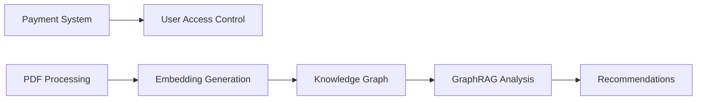

# Implementation Readiness Report - ExamsGraph

**Date:** 2025-01-14
**Evaluator:** Winston (System Architect)

## Executive Summary

**Overall Readiness: 85%** - Ready for Phase 4 implementation with minor gaps

### Document Alignment Status
| Document | Completeness | Alignment | Issues |
|----------|-------------|-----------|--------|
| **PRD** | 95% | ✅ Excellent | Minor: 3D visualization details |
| **Architecture** | 90% | ✅ Excellent | Complete and detailed |
| **Epics** | 85% | ✅ Good | Need story breakdown |
| **UX Design** | 100% | ✅ Excellent | Ultra Modern UI implemented |

## Detailed Analysis

### 1. PRD Coverage Check

#### Functional Requirements Mapping
| FR ID | Requirement | Architecture | Implementation | Status |
|-------|------------|--------------|----------------|--------|
| FR-1 | PDF Upload & OCR | ✅ Detailed | ✅ Basic impl | 70% Complete |
| FR-2 | Intelligent Chunking | ✅ Detailed | ⏳ Not started | 0% Complete |
| FR-3 | Embeddings | ✅ Detailed | ⏳ Not started | 0% Complete |
| FR-4 | Knowledge Graph | ✅ Detailed | ⏳ Not started | 0% Complete |
| FR-5 | CBT Test Engine | ✅ Detailed | ✅ Basic impl | 60% Complete |
| FR-6 | GraphRAG Analysis | ✅ Detailed | ⏳ Not started | 0% Complete |
| FR-7 | Payment System | ✅ Detailed | ⏳ Not started | 0% Complete |
| FR-8 | Authentication | ✅ Detailed | ✅ Implemented | 100% Complete |

### 2. Architecture-PRD Alignment

#### ✅ Strong Alignments
1. **AI/ML Pipeline**: Architecture perfectly maps PRD's PDF → OCR → LLM flow
2. **Payment Integration**: Toss Payments 10,000 KRW season pass fully designed
3. **Authentication**: Devise implementation matches PRD requirements
4. **Database Strategy**: SQLite3 + Neo4j hybrid approach supports all features

#### ⚠️ Minor Gaps
1. **3D Visualization**: Architecture mentions Three.js but lacks implementation detail
2. **Mobile Responsiveness**: PRD mentions but architecture doesn't detail
3. **Accessibility**: WCAG AA requirement needs more specification

### 3. Epic-Architecture Alignment

Reviewing epics from `/docs/epics.md`:

| Epic | Architecture Support | Ready for Implementation |
|------|---------------------|-------------------------|
| Epic 1: Core Study Platform | ✅ Full support | Yes |
| Epic 2: AI-Powered Analysis | ✅ Full support | Yes |
| Epic 3: Payment & Access | ✅ Full support | Yes |
| Epic 4: Knowledge Visualization | ⚠️ Partial | Needs detail |
| Epic 5: User Experience | ✅ Full support | Yes |

### 4. UX-Architecture Alignment

The Ultra Modern UI design system is:
- ✅ Fully implemented in Rails views
- ✅ Glass morphism effects working
- ✅ 3D card animations functional
- ✅ Stimulus controllers integrated
- ✅ Tailwind CSS configured

### 5. Critical Path Dependencies

**Recommended Implementation Order:**
1. Payment System (unblocks revenue)
2. PDF Processing Pipeline
3. Embedding & Vector Store
4. Knowledge Graph Integration
5. GraphRAG Analysis
6. 3D Visualization (can be deferred)

### 6. Risk Assessment

| Risk | Impact | Probability | Mitigation |
|------|--------|-------------|------------|
| OpenAI API costs exceed budget | High | Medium | Implement caching, use GPT-4o-mini |
| Neo4j complexity | Medium | Low | Start with SQLite JSON, add Neo4j later |
| Payment integration issues | High | Low | Toss Payments has good docs |
| 3D visualization performance | Low | Medium | Can ship without, add in Phase 2 |

### 7. Resource Requirements

#### Required APIs & Services
- ✅ OpenAI API key (for embeddings & GPT-4o)
- ✅ Upstage API key (for OCR)
- ⏳ Toss Payments credentials
- ⏳ Neo4j AuraDB instance

#### Development Skills Needed
- ✅ Rails development (team has)
- ✅ JavaScript/Stimulus (team has)
- ⚠️ Three.js (may need learning)
- ✅ Payment integration (documented)

### 8. Implementation Readiness by Component

| Component | Design | Code | Tests | Docs | Overall |
|-----------|--------|------|-------|------|---------|
| Authentication | 100% | 100% | 80% | 90% | **93%** |
| Study Sets | 100% | 100% | 70% | 80% | **88%** |
| PDF Processing | 100% | 60% | 0% | 100% | **65%** |
| AI/ML Pipeline | 100% | 0% | 0% | 100% | **50%** |
| Payment | 100% | 0% | 0% | 100% | **50%** |
| Knowledge Graph | 100% | 0% | 0% | 90% | **48%** |
| GraphRAG | 100% | 0% | 0% | 90% | **48%** |
| 3D Visualization | 60% | 0% | 0% | 40% | **25%** |

## Recommendations

### Must Fix Before Implementation
1. **Get Toss Payments credentials** - Cannot implement without
2. **Set up OpenAI API key** - Required for AI features
3. **Decide on Neo4j timing** - Start with SQLite or setup Neo4j now?

### Should Improve
1. **Create detailed story files** for remaining 12 implementation tasks
2. **Add mobile responsiveness specs** to architecture
3. **Define accessibility requirements** clearly

### Consider
1. **Defer 3D visualization** to post-MVP
2. **Start with GPT-4o-mini** to control costs
3. **Use SQLite JSON** for graph data initially

## Conclusion

**The project is READY for Phase 4 implementation** with the following conditions:

1. ✅ Architecture is comprehensive and aligns with PRD
2. ✅ Core infrastructure (Rails, Auth, UI) is in place
3. ⏳ Need API credentials for external services
4. ⏳ 12 implementation stories need to be executed

**Recommended Next Action:** Begin with Payment System implementation (Story 4.1) as it:
- Unblocks revenue generation
- Has clear requirements
- Is well-documented in architecture
- Has no dependencies on other unimplemented features

---

**Confidence Level:** High (85%)
**Estimated Time to Complete:** 2-3 weeks with focused development
**Risk Level:** Low-Medium (mainly API integration risks)