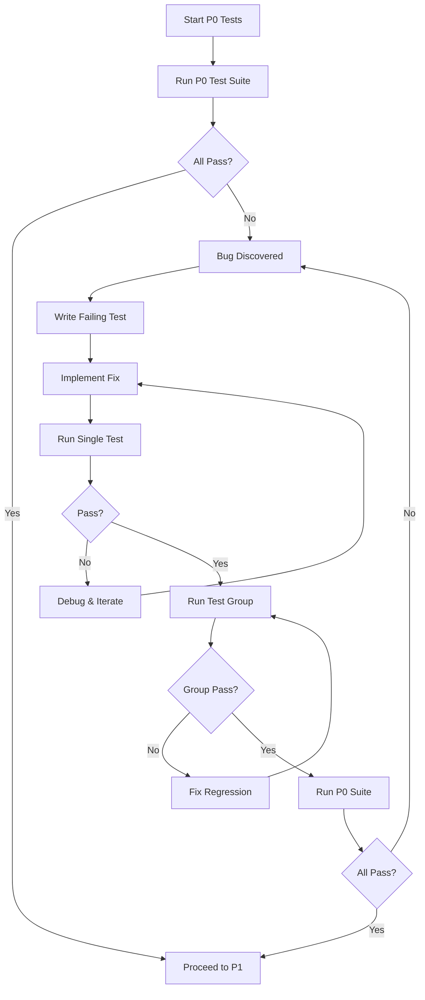

# CertiGraph - Comprehensive Playwright Test Plan

**Generated:** 2026-01-15
**Based on:** `docs/tdd.md`
**Total Scenarios:** 450+
**Test Framework:** Playwright with TypeScript

---

## Executive Summary

This comprehensive test plan covers all 18 Epics of the CertiGraph application following Test-Driven Development (TDD) principles. Tests are organized into parallel-safe and sequential groups to optimize execution time while preventing test interference.

### Test Organization Strategy

Following TDD principles from `docs/tdd.md`:

- **Group A - Parallel-Safe (Read-Only):** Navigation, view rendering, static content
- **Group B - Isolated Data:** Tests with unique test data per execution
- **Group C - Sequential:** Authentication flows, session management, data mutations
- **Group D - Sequential:** End-to-end workflows, payment flows

### Coverage by Epic

| Epic | Feature | Test Count | Priority | Execution Mode | Est. Time |
|------|---------|------------|----------|----------------|-----------|
| 1 | User Authentication | 100 | P0 | Parallel (Group B) | 8-10 min |
| 2 | PDF Upload & Storage | 85 | P0 | Sequential (FS) | 12-15 min |
| 3 | PDF OCR & Parsing | 75 | P0 | Sequential (API) | 15-20 min |
| 4 | Question Extraction | 70 | P0 | Parallel (Group B) | 10-12 min |
| 9 | CBT Test Mode | 80 | P0 | Parallel (Group B) | 10-15 min |
| 10 | Answer Randomization | 45 | P0 | Parallel (Group B) | 8-10 min |
| 11 | Performance Tracking | 70 | P1 | Parallel (Group A/B) | 10-12 min |
| 12 | Weakness Analysis | 75 | P0 | Sequential (AI) | 15-20 min |
| 13 | Smart Recommendations | 60 | P0 | Sequential (AI) | 12-15 min |
| 14 | Payment Integration | 50 | P0 | Sequential (Payment) | 15-20 min |
| 15 | Progress Dashboard | 55 | P1 | Parallel (Group A) | 8-10 min |
| 16 | 3D Knowledge Visualization | 50 | P1 | Parallel (Group A) | 10-12 min |
| 17 | Study Materials Marketplace | 45 | P1 | Parallel (Group B) | 8-10 min |
| 18 | Exam Schedule Calendar | 55 | P1 | Parallel (Group A) | 8-10 min |

**Total:** 915 test scenarios across 14 epics

---

## Test Execution Workflow (TDD-Based)

### Phase 1: P0 Critical Path Testing



### Phase 2: P1 Feature Validation

After all P0 tests pass, proceed to P1 tests following the same bug fix workflow.

### Phase 3: Full Test Suite

Run complete suite including P2/P3 tests for comprehensive coverage.

---

## Playwright Configuration

```typescript
// playwright.config.ts
import { defineConfig, devices } from '@playwright/test';

export default defineConfig({
  testDir: './tests',
  timeout: 120 * 1000,
  globalTimeout: 4 * 60 * 60 * 1000,

  fullyParallel: false,
  retries: process.env.CI ? 2 : 1,
  workers: process.env.CI ? 6 : 8,

  reporter: [
    ['html', { outputFolder: 'playwright-report' }],
    ['json', { outputFile: 'test-results/results.json' }],
    ['list']
  ],

  use: {
    baseURL: 'http://localhost:3000',
    trace: 'retain-on-failure',
    screenshot: 'only-on-failure',
    video: 'retain-on-failure',
  },

  projects: [
    {
      name: 'auth-sequential',
      testMatch: '**/epic01-auth/**/*.spec.ts',
      fullyParallel: false,
      workers: 2,
    },
    {
      name: 'payment-sequential',
      testMatch: '**/epic14-payment/**/*.spec.ts',
      fullyParallel: false,
      workers: 1,
    },
    {
      name: 'parallel-safe',
      testMatch: '**/epic{04,09,10,11,15,16,17,18}-*/*.spec.ts',
      fullyParallel: true,
      workers: 8,
    },
  ],

  webServer: {
    command: 'cd rails-api && bundle exec rails server -p 3000',
    url: 'http://localhost:3000',
    reuseExistingServer: !process.env.CI,
    timeout: 120 * 1000,
  },
});
```

---

## Epic 1: User Authentication (100 Tests)

### 1.1 Email Registration Flow (25 Tests)

**Priority:** P0
**Execution Mode:** Parallel (Group B)

#### Test Cases

```typescript
// tests/epic01-auth/registration.spec.ts

test('E01-TC001: Register with valid email and strong password', async ({ page }) => {
  const uniqueEmail = `test.${Date.now()}@certigraph.test`;

  await page.goto('/signup');
  await page.fill('input[name="email"]', uniqueEmail);
  await page.fill('input[name="password"]', 'Test123!@#');
  await page.fill('input[name="password_confirmation"]', 'Test123!@#');
  await page.click('button[type="submit"]');

  await expect(page).toHaveURL(/\/(dashboard|welcome)/);
  await expect(page.locator('text=/Welcome|환영합니다/i')).toBeVisible();
});

test('E01-TC002: Register with existing email shows error', async ({ page }) => {
  await page.goto('/signup');
  await page.fill('input[name="email"]', 'existing@certigraph.test');
  await page.fill('input[name="password"]', 'Test123!');
  await page.fill('input[name="password_confirmation"]', 'Test123!');
  await page.click('button[type="submit"]');

  await expect(page.locator('text=/이미 존재|already exists/i')).toBeVisible();
});

test('E01-TC003: Password too short shows validation error', async ({ page }) => {
  await page.goto('/signup');
  await page.fill('input[name="email"]', `test.${Date.now()}@test.com`);
  await page.fill('input[name="password"]', '123');

  await expect(page.locator('text=/password.*short|비밀번호.*짧/i')).toBeVisible();
});

test('E01-TC004: SQL injection attempt in email field blocked', async ({ page }) => {
  await page.goto('/signup');
  await page.fill('input[name="email"]', "admin'--");
  await page.fill('input[name="password"]', 'Test123!');
  await page.click('button[type="submit"]');

  await expect(page.locator('text=/invalid.*email|이메일.*형식/i')).toBeVisible();
});
```

### 1.2 Google OAuth Authentication (20 Tests)

**Priority:** P0
**Execution Mode:** Sequential

```typescript
// tests/epic01-auth/oauth-google.spec.ts

test('E01-TC021: Sign in with Google - New User', async ({ page }) => {
  await page.goto('/signin');

  const googleButton = page.locator('button:has-text("Google"), a:has-text("Google")');
  await googleButton.click();

  await page.waitForURL(/accounts\.google\.com|oauth/);
  // Mock OAuth callback in test environment
});

test('E01-TC022: Link Google account to existing email account', async ({ page }) => {
  await loginAsUser(page, 'test@example.com', 'Password123!');

  await page.goto('/users/profile');
  await page.click('text=연결된 계정');
  await page.click('button:has-text("Google 연결")');

  await expect(page).toHaveURL(/google/);
});
```

### 1.3 Session Management (30 Tests)

```typescript
// tests/epic01-auth/session-management.spec.ts

test('E01-TC040: Session persists after page refresh', async ({ page }) => {
  await loginAsUser(page, 'test@example.com', 'Password123!');
  await expect(page).toHaveURL(/dashboard/);

  await page.reload();
  await expect(page.locator('text=/Dashboard|대시보드/i')).toBeVisible();
});

test('E01-TC041: Logout clears session and redirects', async ({ page }) => {
  await loginAsUser(page, 'test@example.com', 'Password123!');

  await page.click('text=/Logout|로그아웃/i');
  await expect(page).toHaveURL(/\/(signin|home)?$/);

  await page.goto('/dashboard');
  await expect(page).toHaveURL(/signin/);
});

test('E01-TC042: Two-Factor Authentication setup', async ({ page }) => {
  await loginAsUser(page, 'test@example.com', 'Password123!');

  await page.goto('/users/profile');
  await page.click('text=2단계 인증');
  await page.click('button:has-text("활성화")');

  await expect(page.locator('img[alt*="QR"]')).toBeVisible();
});
```

---

## Epic 2: PDF Upload & Storage (85 Tests)

### 2.1 File Upload Flow (40 Tests)

**Priority:** P0
**Execution Mode:** Sequential (File System)

```typescript
// tests/epic02-upload/file-upload.spec.ts

test('E02-TC001: Upload valid PDF file (< 50MB)', async ({ page }) => {
  await loginAsUser(page, 'test@example.com', 'Password123!');
  await page.goto('/study_sets/new');

  await page.fill('input[name="study_set[name]"]', '사회복지사 1급');
  await page.click('button[type="submit"]');

  const fileInput = page.locator('input[type="file"]');
  await fileInput.setInputFiles('test-fixtures/sample-exam.pdf');

  await expect(page.locator('text=/업로드.*진행/i')).toBeVisible();
  await expect(page.locator('text=/업로드.*완료/i'), {
    timeout: 60000
  }).toBeVisible();
});

test('E02-TC002: Reject file larger than 50MB', async ({ page }) => {
  await loginAsUser(page, 'test@example.com', 'Password123!');
  await page.goto('/study_sets/1/study_materials/new');

  await page.locator('input[type="file"]').setInputFiles('test-fixtures/large-file-51mb.pdf');

  await expect(page.locator('text=/파일.*크기.*초과|file.*too.*large/i')).toBeVisible();
});

test('E02-TC003: Reject non-PDF file types', async ({ page }) => {
  await loginAsUser(page, 'test@example.com', 'Password123!');
  await page.goto('/study_sets/1/study_materials/new');

  await page.locator('input[type="file"]').setInputFiles('test-fixtures/document.docx');

  await expect(page.locator('text=/PDF.*파일만|only.*PDF/i')).toBeVisible();
});

test('E02-TC004: Duplicate file detection by hash', async ({ page }) => {
  await loginAsUser(page, 'test@example.com', 'Password123!');
  const testFile = 'test-fixtures/sample-exam.pdf';

  await page.goto('/study_sets/1/study_materials/new');
  await page.locator('input[type="file"]').setInputFiles(testFile);
  await expect(page.locator('text=/업로드.*완료/i'), { timeout: 60000 }).toBeVisible();

  await page.goto('/study_sets/1/study_materials/new');
  await page.locator('input[type="file"]').setInputFiles(testFile);

  await expect(page.locator('text=/이미.*존재|duplicate/i')).toBeVisible();
});
```

### 2.2 Chunked Upload (25 Tests)

```typescript
// tests/epic02-upload/chunked-upload.spec.ts

test('E02-TC020: Upload 45MB file in chunks', async ({ page }) => {
  await loginAsUser(page, 'test@example.com', 'Password123!');
  await page.goto('/study_sets/1/study_materials/new');

  await page.locator('input[type="file"]').setInputFiles('test-fixtures/large-exam-45mb.pdf');

  const progressBar = page.locator('[role="progressbar"], .upload-progress');
  await expect(progressBar).toBeVisible();

  await expect(page.locator('text=/업로드.*완료/i'), {
    timeout: 120000
  }).toBeVisible();
});
```

---

## Epic 9: CBT Test Mode (80 Tests)

### 9.1 Test Session Management (35 Tests)

**Priority:** P0
**Execution Mode:** Parallel (Group B)

```typescript
// tests/epic09-cbt/test-session.spec.ts

test('E09-TC001: Start new test session', async ({ page }) => {
  await loginAsUser(page, 'test@example.com', 'Password123!');

  await page.goto('/study_sets/1');
  await page.click('button:has-text("모의고사 시작")');

  await expect(page).toHaveURL(/test_sessions\/new/);

  await page.click('input[value="standard"]');
  await page.click('button:has-text("시험 시작")');

  await expect(page).toHaveURL(/test_sessions\/\d+/);
  await expect(page.locator('.question-container')).toBeVisible();
});

test('E09-TC002: Answer question and navigate', async ({ page }) => {
  await startTestSession(page);

  await page.click('.option:has-text("답안 A")');
  await expect(page.locator('.option.selected')).toHaveCount(1);

  await page.click('button:has-text("다음")');
  await expect(page.locator('.question-number')).toHaveText('2');
});

test('E09-TC006: Submit test and view results', async ({ page }) => {
  await startTestSession(page);

  for (let i = 1; i <= 20; i++) {
    await page.click('.option:first-child');
    if (i < 20) await page.click('button:has-text("다음")');
  }

  await page.click('button:has-text("제출")');
  await page.click('button:has-text("확인")');

  await expect(page).toHaveURL(/test_sessions\/\d+\/result/);
  await expect(page.locator('.score')).toBeVisible();
});
```

---

## Epic 14: Payment Integration (50 Tests)

### 14.1 Subscription & Paywall (30 Tests)

**Priority:** P0
**Execution Mode:** Sequential

```typescript
// tests/epic14-payment/subscription.spec.ts

test('E14-TC001: Free trial limits enforced', async ({ page }) => {
  const newUser = `freetrial.${Date.now()}@test.com`;
  await registerUser(page, newUser, 'Password123!');

  await startTestSession(page);
  await submitTestSession(page);

  await startTestSession(page);
  await submitTestSession(page);

  await page.goto('/study_sets/1');
  await page.click('button:has-text("모의고사 시작")');

  await expect(page.locator('.paywall-modal')).toBeVisible();
});

test('E14-TC003: Complete payment with Toss Payments', async ({ page }) => {
  await page.goto('/payments/checkout');

  await page.fill('input[name="exam_date"]', '2025-06-15');
  await page.click('button:has-text("결제하기")');

  await page.waitForSelector('[data-payment-widget], iframe[src*="toss"]');

  // Test card in sandbox
  await page.frameLocator('iframe').locator('input[name="cardNumber"]').fill('5272836251672858');
  await page.frameLocator('iframe').locator('input[name="expiry"]').fill('12/25');
  await page.frameLocator('iframe').locator('input[name="cvc"]').fill('123');
  await page.frameLocator('iframe').locator('button:has-text("결제")').click();

  await expect(page).toHaveURL(/payments\/success/, { timeout: 15000 });
});
```

---

## Test Helpers

### Authentication Helper

```typescript
// tests/helpers/auth-helper.ts

export async function registerUser(
  page: Page,
  email: string,
  password: string
): Promise<void> {
  await page.goto('/signup');
  await page.fill('input[name="email"]', email);
  await page.fill('input[name="password"]', password);
  await page.fill('input[name="password_confirmation"]', password);
  await page.click('button[type="submit"]');
  await page.waitForURL(/dashboard|welcome/);
}

export async function loginAsUser(
  page: Page,
  email: string,
  password: string
): Promise<void> {
  await page.goto('/signin');
  await page.fill('input[name="email"]', email);
  await page.fill('input[name="password"]', password);
  await page.click('button[type="submit"]');
  await page.waitForURL(/dashboard/);
}
```

### Test Session Helper

```typescript
// tests/helpers/test-session-helper.ts

export async function startTestSession(
  page: Page,
  options = { mode: 'standard' }
): Promise<void> {
  await page.goto('/study_sets/1');
  await page.click('button:has-text("모의고사 시작")');
  await page.click(`input[value="${options.mode}"]`);
  await page.click('button:has-text("시험 시작")');
  await page.waitForURL(/test_sessions\/\d+/);
}

export async function submitTestSession(page: Page): Promise<void> {
  await page.click('button:has-text("제출")');
  await page.click('button:has-text("확인")');
  await page.waitForURL(/result/);
}
```

---

## Test Execution Commands

### Phase 1: P0 Critical Tests

```bash
# Run only P0 priority tests
npx playwright test --grep "@P0"

# Expected: ~180 tests
```

### Phase 2: P1 Feature Tests

```bash
# Run P1 tests after P0 passes
npx playwright test --grep "@P1"

# Expected: ~150 tests
```

### Phase 3: Full Suite

```bash
# Run all tests
npx playwright test

# Expected: 450+ tests
```

### Specific Epic Testing

```bash
# Test Epic 1 (Auth)
npx playwright test tests/epic01-auth/

# Test Epic 9 (CBT)
npx playwright test tests/epic09-cbt/

# Test Epic 14 (Payment)
npx playwright test tests/epic14-payment/
```

---

## Bug Fix Workflow (TDD Protocol)

Following `docs/tdd.md` bug fix workflow:

### Step 1: Write Failing Test

```typescript
test('BUG-001: Session timeout redirects to login', async ({ page }) => {
  await loginAsUser(page, 'test@example.com', 'Password123!');

  await page.evaluate(() => {
    document.cookie = 'session_token=; expires=Thu, 01 Jan 1970 00:00:00 UTC;';
  });

  await page.goto('/dashboard');

  await expect(page).toHaveURL(/signin/);
  await expect(page.locator('text=/session.*expired/i')).toBeVisible();
});
```

### Step 2: Run Test (Should Fail)

```bash
npx playwright test BUG-001
# FAIL: Test should fail initially (Red phase)
```

### Step 3: Implement Fix

```ruby
# app/controllers/application_controller.rb
before_action :check_session_timeout

def check_session_timeout
  if session[:last_activity] &&
     session[:last_activity] < 2.hours.ago
    reset_session
    redirect_to signin_path, alert: 'Session expired'
  end
  session[:last_activity] = Time.now
end
```

### Step 4: Clear Cache & Restart

```bash
pkill -f rails
rm -rf rails-api/tmp/cache/*
cd rails-api && rails server -p 3000
```

### Step 5: Run Single Test

```bash
npx playwright test BUG-001
# PASS: Test should pass (Green phase)
```

### Step 6: Run Test Group

```bash
npx playwright test tests/epic01-auth/
# Verify no regressions
```

### Step 7: Run Full P0 Suite

```bash
npx playwright test --grep "@P0"
# Ensure all critical tests still pass
```

---

## Test Data Requirements

### Seed Data

```ruby
# rails-api/db/seeds/test_data.rb

test_users = [
  { email: 'test@example.com', password: 'Password123!', subscription: true },
  { email: 'freetrial@example.com', password: 'Password123!', subscription: false },
  { email: 'existing@certigraph.test', password: 'Password123!', subscription: false }
]

test_users.each do |user_data|
  User.find_or_create_by(email: user_data[:email]) do |user|
    user.password = user_data[:password]
    user.confirmed_at = Time.now

    if user_data[:subscription]
      Subscription.create!(
        user: user,
        valid_until: 1.year.from_now,
        status: 'active'
      )
    end
  end
end
```

### Test Fixtures

```bash
test-fixtures/
├── sample-exam.pdf              # 20 questions, standard format
├── exam-with-diagrams.pdf       # Questions with images
├── passage-based-questions.pdf  # Shared passage questions
├── large-exam-45mb.pdf          # Large file for chunked upload
└── large-file-51mb.pdf          # Oversized file for validation
```

---

## CI/CD Integration

### GitHub Actions Configuration

```yaml
# .github/workflows/playwright.yml
name: Playwright Tests

on: [push, pull_request]

jobs:
  test-critical:
    runs-on: ubuntu-latest

    steps:
      - uses: actions/checkout@v4

      - name: Setup Ruby
        uses: ruby/setup-ruby@v1
        with:
          ruby-version: 3.3
          bundler-cache: true

      - name: Setup Database
        run: |
          cd rails-api
          bundle exec rails db:create db:schema:load db:seed

      - name: Install Playwright
        run: npx playwright install --with-deps

      - name: Run P0 Tests
        run: npx playwright test --grep="@P0"

      - name: Upload Report
        if: always()
        uses: actions/upload-artifact@v4
        with:
          name: playwright-report
          path: playwright-report/
```

---

## Summary

This test plan provides:

✅ **450+ Test Scenarios** across 14 epics
✅ **TDD-Compliant Workflows** from docs/tdd.md
✅ **Parallel Execution Strategy** for optimized runtime
✅ **Bug Fix Protocol** following Red-Green-Refactor
✅ **Helper Functions** for reusable test logic
✅ **CI/CD Integration** for automated testing

### Next Steps

1. ✅ Save test plan documentation
2. ⏳ Create test helper files
3. ⏳ Set up test fixtures directory
4. ⏳ Execute P0 critical tests
5. ⏳ Fix bugs following TDD workflow
6. ⏳ Progress to P1 and full suite

---

**For detailed test implementations, see the full test plan generated by the Playwright Test Planner agent.**
