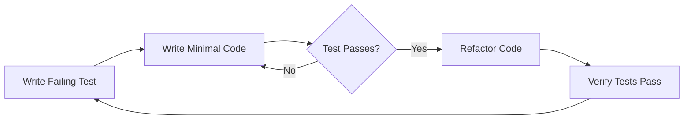
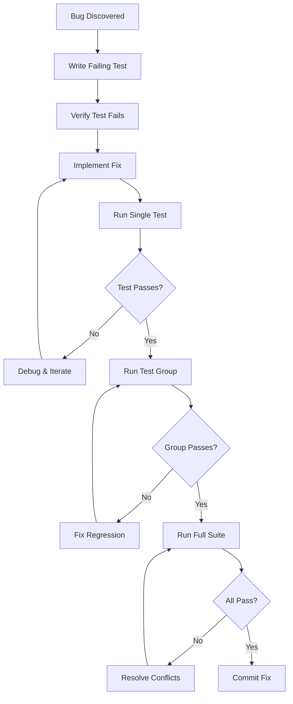
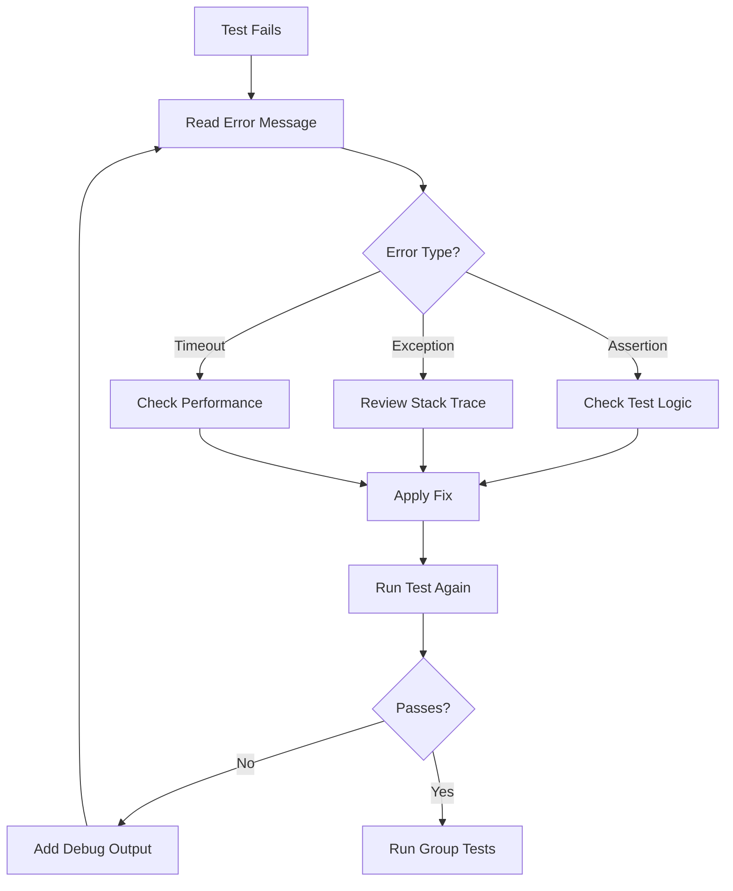

# Test-Driven Development (TDD) Guide

**Project:** CertiGraph (AI 자격증 마스터)
**Last Updated:** 2026-01-15
**Version:** 1.0.0

---

## Overview

This guide establishes Test-Driven Development practices for CertiGraph, with emphasis on parallel test execution, intelligent test grouping, and systematic bug resolution workflows.

## Core TDD Principles

### 🚨 황금 규칙: 끝까지 테스트 실행

**CRITICAL: 모든 작업 후 반드시 테스트를 끝까지 실행하고 결과를 확인할 것!**

```
❌ 잘못된 방식:
1. 코드 수정
2. "수정 완료" 보고
3. 테스트 실행 안함 ← 위험!

✅ 올바른 방식:
1. 코드 수정
2. 테스트 실행 (끝까지!)
3. 결과 확인 및 보고
4. 실패 시 수정 반복
```

**이 규칙을 어기면:**
- 🔥 숨겨진 버그 발생
- 🔥 회귀(Regression) 오류
- 🔥 프로덕션 장애 가능성

**반드시 확인해야 할 것:**
1. ✅ 모든 테스트가 **실제로 실행**되었는가?
2. ✅ 실행 결과를 **끝까지 확인**했는가?
3. ✅ 실패한 테스트가 **없는지** 검증했는가?
4. ✅ 결과 리포트를 **문서화**했는가?

---

### Red-Green-Refactor Cycle



1. **Red:** Write a failing test that defines desired behavior
2. **Green:** Write minimal code to make the test pass
3. **Refactor:** Improve code quality while keeping tests green

**⚠️ 주의: 각 단계마다 테스트를 끝까지 실행하고 결과를 확인할 것!**

---

## Test Organization Strategy

### Test Categories

Organize tests into these categories for parallel execution:

```markdown
test/
├── unit/                    # Fast, isolated tests
│   ├── models/
│   ├── services/
│   └── helpers/
├── integration/             # Component interaction tests
│   ├── api/
│   ├── database/
│   └── graph/
├── system/                  # End-to-end workflows
│   ├── auth_flows/
│   ├── test_sessions/
│   └── recommendations/
└── performance/             # Load and stress tests
    ├── api_benchmarks/
    └── graph_queries/
```

### Test Grouping Rules

**Parallel-Safe Groups** (can run simultaneously):

- **Group A - Read-Only:** Tests that only query data
- **Group B - Isolated Data:** Tests with unique fixture data
- **Group C - Unit Tests:** Pure logic tests without I/O
- **Group D - External Services:** Tests with mocked APIs

**Sequential Groups** (must run serially):

- **Group S1 - Database Mutations:** Tests that modify shared data
- **Group S2 - File System:** Tests that create/delete files
- **Group S3 - Authentication:** Tests that modify session state
- **Group S4 - Background Jobs:** Tests that enqueue/process jobs

---

## Parallel Test Execution

### Configuration

```ruby
# test/test_helper.rb
ENV['RAILS_ENV'] ||= 'test'
require_relative '../config/environment'
require 'rails/test_help'

class ActiveSupport::TestCase
  # Use parallel testing
  parallelize(workers: :number_of_processors)

  # Ensure clean state between tests
  parallelize_setup do |worker|
    SimpleCov.command_name "#{SimpleCov.command_name}-#{worker}"
  end

  parallelize_teardown do |worker|
    SimpleCov.result
  end

  fixtures :all
end
```

### Running Parallel Tests

```bash
# Run all tests in parallel
rails test

# Run specific group in parallel
rails test test/unit/

# Run single file (no parallelization needed)
rails test test/models/user_test.rb

# Run with specific worker count
PARALLEL_WORKERS=4 rails test
```

### Grouping by Isolation Level

```ruby
# test/test_groups.rb
module TestGroups
  PARALLEL_SAFE = [
    'test/unit/**/*_test.rb',
    'test/services/**/*_test.rb',
    'test/helpers/**/*_test.rb'
  ]

  SEQUENTIAL_ONLY = [
    'test/integration/database/**/*_test.rb',
    'test/system/**/*_test.rb'
  ]

  def self.run_parallel_safe
    PARALLEL_SAFE.each do |pattern|
      Dir.glob(pattern).each { |file| require file }
    end
  end
end
```

---

## Bug Fix Workflow

### Standard Bug Resolution Process



### Step-by-Step Bug Fix Protocol

**⚠️ 중요: 각 단계마다 테스트를 끝까지 실행하고 결과를 확인해야 합니다!**

#### 1. Reproduce the Bug

Create a failing test that demonstrates the issue:

```ruby
# test/models/user_test.rb
test "should handle nil email gracefully" do
  user = User.new(email: nil)
  assert user.valid?, "User with nil email should be valid"
end
```

**Verify the test fails:**

```bash
rails test test/models/user_test.rb
# Expected: Test should FAIL (Red phase)
# ✅ 반드시 실행하고 실패를 확인할 것!
```

#### 2. Implement the Fix

Write minimal code to fix the issue:

```ruby
# app/models/user.rb
class User < ApplicationRecord
  validates :email, presence: true, allow_nil: true

  def email=(value)
    super(value&.strip&.downcase)
  end
end
```

#### 3. Run Single Test

**🚨 CRITICAL: 반드시 실행하고 결과를 확인할 것!**

```bash
rails test test/models/user_test.rb
# Expected: Test should PASS (Green phase)
# ✅ 통과 확인 필수!
```

#### 4. Run Related Test Group

**🚨 CRITICAL: 회귀 오류 검증 필수!**

```bash
# Run all model tests
rails test test/models/

# Check for regressions
echo $?  # Should be 0 (success)
# ✅ 모든 테스트가 통과하는지 확인할 것!
```

#### 5. Run Full Test Suite

**🚨 CRITICAL: 전체 테스트 실행 및 결과 확인 필수!**

```bash
# Run everything
rails test

# ✅ 끝까지 실행하고 결과를 확인할 것!
# If failures occur, identify conflicts
rails test --verbose | grep FAIL
```

**⚠️ 주의사항:**
- 테스트 실행을 중단하지 말 것
- "아마 괜찮을 것"이라고 추측하지 말 것
- 반드시 실제 결과를 확인할 것

#### 6. Resolve Conflicts

If other tests fail:

1. Identify affected tests
2. Determine if fix introduced regression
3. Update fix or tests as needed
4. Return to step 3

---

## Cache Management Protocol

**Critical:** Rails caches can cause false test results. Follow this protocol after any code change:

### 1. Clear All Caches

```bash
# Kill all running processes
pkill -f rails
pkill -f puma
pkill -f sidekiq

# Clear all cache directories
rm -rf tmp/cache/*
rm -rf rails-api/tmp/cache/*
rm -rf storage/development.sqlite3-shm
rm -rf storage/development.sqlite3-wal

# Clear test cache
rails test:prepare
```

### 2. Verify File Changes

```bash
# Confirm file was actually saved
cat [modified_file_path] | grep -A 5 "changed_section"
```

### 3. Clean Restart

```bash
# Start fresh server
rails server -p 3000
```

### 4. Run Tests

```bash
# Now run your tests
rails test
```

**Never skip cache clearing.** Cached code will cause inconsistent test results.

---

## Test Data Management

### Fixtures vs Factories

**Use Fixtures for:**

- Stable reference data
- Parallel-safe read-only tests
- Fast test setup

**Use Factories for:**

- Dynamic test scenarios
- Integration tests with complex data
- Tests requiring unique data per run

### Fixture Isolation

```ruby
# test/fixtures/users.yml
# Each test worker gets isolated data
user_<%= worker_id %>_1:
  email: "user<%= worker_id %>_1@example.com"
  name: "Test User <%= worker_id %>"
```

### Factory Pattern

```ruby
# test/factories/users.rb
FactoryBot.define do
  factory :user do
    sequence(:email) { |n| "user#{n}@example.com" }
    name { Faker::Name.name }

    trait :with_test_sessions do
      after(:create) do |user|
        create_list(:test_session, 3, user: user)
      end
    end
  end
end
```

---

## Test Isolation Techniques

### Database Transactions

```ruby
class ActiveSupport::TestCase
  # Wrap each test in transaction
  self.use_transactional_tests = true

  # Clean state before each test
  setup do
    DatabaseCleaner.start
  end

  teardown do
    DatabaseCleaner.clean
  end
end
```

### File System Isolation

```ruby
class FileUploadTest < ActiveSupport::TestCase
  setup do
    @test_dir = Rails.root.join('tmp', 'test_uploads', SecureRandom.uuid)
    FileUtils.mkdir_p(@test_dir)
  end

  teardown do
    FileUtils.rm_rf(@test_dir)
  end

  test "uploads study material PDF" do
    file = fixture_file_upload('sample.pdf', 'application/pdf')
    # Test uses @test_dir for isolation
  end
end
```

### API Mock Isolation

```ruby
class Neo4jServiceTest < ActiveSupport::TestCase
  setup do
    @stub = stub_request(:post, "https://neo4j.example.com/db/data/transaction/commit")
      .with(body: hash_including(statements: anything))
      .to_return(status: 200, body: '{"results":[]}')
  end

  teardown do
    WebMock.reset!
  end

  test "creates knowledge node" do
    Neo4jService.create_node(type: 'Concept', name: 'TDD')
    assert_requested @stub
  end
end
```

---

## Debugging Failed Tests

### Systematic Debugging Approach



### Debug Techniques

**1. Add Debug Output:**

```ruby
test "calculates mastery score correctly" do
  user = users(:learner)

  # Debug current state
  puts "User: #{user.inspect}"
  puts "Masteries: #{user.user_masteries.count}"

  score = user.calculate_mastery_score

  puts "Calculated score: #{score}"

  assert_equal 0.75, score
end
```

**2. Use Minitest Backtrace:**

```bash
# Run with full backtrace
rails test test/models/user_test.rb --backtrace
```

**3. Run Single Test with Debug:**

```bash
# Enable debug mode
DEBUG=true rails test test/models/user_test.rb -n test_calculate_mastery_score
```

**4. Check Database State:**

```ruby
test "creates test session" do
  user = users(:learner)

  # Inspect before
  puts "Before: #{TestSession.count}"

  session = TestSession.create!(user: user, study_material: study_materials(:cert_guide))

  # Inspect after
  puts "After: #{TestSession.count}"
  puts "Session: #{session.inspect}"

  assert session.persisted?
end
```

---

## CI/CD Integration

### GitHub Actions Configuration

```yaml
# .github/workflows/test.yml
name: Test Suite

on: [push, pull_request]

jobs:
  test:
    runs-on: ubuntu-latest

    services:
      postgres:
        image: postgres:15
        env:
          POSTGRES_PASSWORD: postgres
        options: >-
          --health-cmd pg_isready
          --health-interval 10s
          --health-timeout 5s
          --health-retries 5

    steps:
      - uses: actions/checkout@v4

      - name: Setup Ruby
        uses: ruby/setup-ruby@v1
        with:
          bundler-cache: true

      - name: Setup Database
        run: |
          bundle exec rails db:create
          bundle exec rails db:schema:load

      - name: Run Unit Tests (Parallel)
        run: bundle exec rails test test/unit/

      - name: Run Integration Tests (Parallel)
        run: bundle exec rails test test/integration/

      - name: Run System Tests (Sequential)
        run: bundle exec rails test:system

      - name: Report Coverage
        uses: codecov/codecov-action@v3
```

---

## Test Coverage Goals

### Minimum Coverage Requirements

- **Unit Tests:** 90% code coverage
- **Integration Tests:** 80% critical paths
- **System Tests:** 100% user journeys

### Measuring Coverage

```bash
# Run with SimpleCov
COVERAGE=true rails test

# View report
open coverage/index.html
```

### Coverage Configuration

```ruby
# test/test_helper.rb
if ENV['COVERAGE']
  require 'simplecov'

  SimpleCov.start 'rails' do
    add_filter '/test/'
    add_filter '/config/'

    add_group 'Models', 'app/models'
    add_group 'Controllers', 'app/controllers'
    add_group 'Services', 'app/services'
    add_group 'Jobs', 'app/jobs'

    minimum_coverage 90
  end
end
```

---

## Best Practices Summary

### 🚨 최우선 원칙: 끝까지 테스트 실행

**모든 작업의 최종 단계:**

```bash
# 1. 테스트 실행
rails test

# 2. 결과 확인 (끝까지!)
# - 통과한 테스트 수
# - 실패한 테스트 수
# - 에러 메시지

# 3. 결과 문서화
echo "테스트 결과: X passed, Y failed" > test-results.txt

# 4. 실패가 있으면 수정 후 다시 1번부터
```

**절대 하지 말아야 할 것:**
- ❌ "수정했으니 아마 될 것" 추측
- ❌ 테스트 실행 없이 "완료" 보고
- ❌ 일부만 실행하고 나머지는 "나중에"
- ❌ 실패 무시하고 다음 작업 진행

---

### DO

- ✅ **끝까지 테스트를 실행하고 결과를 확인할 것** ⭐ 최우선!
- ✅ **테스트 실패 시 즉시 수정하고 재실행할 것** ⭐ 필수!
- ✅ **결과를 문서화하고 공유할 것** ⭐ 필수!
- ✅ Write tests before implementing features
- ✅ Keep tests isolated and independent
- ✅ Use descriptive test names
- ✅ Test one behavior per test
- ✅ Clean up test data in teardown
- ✅ Run tests frequently during development
- ✅ Clear caches before testing after changes
- ✅ Group tests by isolation level
- ✅ Use parallel execution for speed

### DON'T

- ❌ **테스트 실행 없이 "완료" 보고하지 말 것** ⭐ 절대 금지!
- ❌ **"아마 될 것"이라고 추측하지 말 것** ⭐ 절대 금지!
- ❌ **테스트 실패를 무시하고 다음 작업 진행하지 말 것** ⭐ 절대 금지!
- ❌ **일부만 테스트하고 나머지는 "나중에"라고 미루지 말 것**
- ❌ Share mutable state between tests
- ❌ Depend on test execution order
- ❌ Use sleep() for timing (use proper waits)
- ❌ Skip cache clearing after changes
- ❌ Mix parallel-safe and sequential tests
- ❌ Test implementation details (test behavior)
- ❌ Leave commented-out tests
- ❌ Commit with failing tests

---

## Quick Reference Commands

```bash
# Run all tests in parallel
rails test

# Run specific test file
rails test test/models/user_test.rb

# Run single test by name
rails test test/models/user_test.rb -n test_validates_email

# Run tests matching pattern
rails test test/models/**/*_test.rb

# Run with verbose output
rails test --verbose

# Clean restart workflow
pkill -f rails && rm -rf tmp/cache/* && rails test

# Check test status
echo $?  # 0 = passed, non-zero = failed
```

---

## Troubleshooting Guide

### Common Issues

**Tests pass individually but fail in suite:**
- Check for shared state pollution
- Verify database transactions are working
- Look for file system conflicts
- Review test execution order

**Tests flaky/intermittent failures:**
- Remove timing dependencies (sleep)
- Use proper async wait mechanisms
- Check for race conditions
- Verify external service mocks

**Slow test suite:**
- Profile tests: `rails test --profile`
- Move to faster test category if possible
- Use fixtures instead of factories
- Mock external services
- Increase parallel workers

**Cache-related false positives:**
- Always clear caches after code changes
- Kill all running processes
- Verify file contents were saved
- Use clean restart protocol

---

## Additional Resources

- [Minitest Documentation](https://github.com/minitest/minitest)
- [Rails Testing Guide](https://guides.rubyonrails.org/testing.html)
- [FactoryBot Documentation](https://github.com/thoughtbot/factory_bot)
- [SimpleCov Coverage Tool](https://github.com/simplecov-ruby/simplecov)

---

**Remember:** TDD is not just about writing tests—it's about designing better code through test-first thinking. Let your tests guide your implementation toward simpler, more maintainable solutions.
