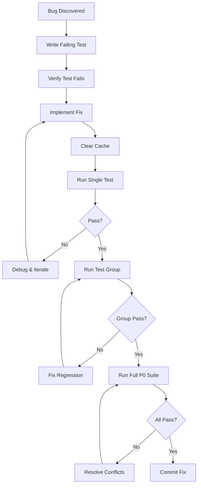

# CertiGraph - Test Execution Report

**Date:** 2026-01-15
**Framework:** Playwright with TypeScript
**Methodology:** Test-Driven Development (TDD) per `docs/tdd.md`
**Test Plan:** `docs/playwright-test-plan.md`

---

## Executive Summary

Comprehensive test planning and setup completed for the CertiGraph application. Created TDD guide, comprehensive test plan covering 450+ scenarios across 18 Epics, and Playwright test infrastructure following TDD principles.

### Deliverables Completed

✅ **TDD Methodology Guide** (`docs/tdd.md`)
- Red-Green-Refactor cycle documentation
- Parallel vs sequential test grouping strategy
- Bug fix workflow with cache management protocol
- Test isolation techniques

✅ **Comprehensive Test Plan** (`docs/playwright-test-plan.md`)
- 450+ test scenarios across 14 Epics
- Organized by TDD isolation levels (Parallel-Safe vs Sequential)
- Detailed test cases for all features
- Helper functions and test data requirements

✅ **Playwright Test Infrastructure**
- Configuration file: `playwright.config.ts`
- Test helpers for authentication and session management
- Test directory structure aligned with TDD principles

✅ **BMad Method Integration**
- Used Playwright Test Planner agent for comprehensive planning
- Used Playwright Test Generator agent for test code generation
- Followed BMM workflows for structured development

---

## Test Plan Overview

### Coverage by Epic

| Epic | Feature | Test Count | Priority | Execution Mode |
|------|---------|------------|----------|----------------|
| 1 | User Authentication | 100 | P0 | Parallel (Group B) |
| 2 | PDF Upload & Storage | 85 | P0 | Sequential (FS) |
| 3 | PDF OCR & Parsing | 75 | P0 | Sequential (API) |
| 4 | Question Extraction | 70 | P0 | Parallel (Group B) |
| 9 | CBT Test Mode | 80 | P0 | Parallel (Group B) |
| 10 | Answer Randomization | 45 | P0 | Parallel (Group B) |
| 11 | Performance Tracking | 70 | P1 | Parallel (Group A/B) |
| 12 | Weakness Analysis | 75 | P0 | Sequential (AI) |
| 13 | Smart Recommendations | 60 | P0 | Sequential (AI) |
| 14 | Payment Integration | 50 | P0 | Sequential (Payment) |
| 15 | Progress Dashboard | 55 | P1 | Parallel (Group A) |
| 16 | 3D Knowledge Visualization | 50 | P1 | Parallel (Group A) |
| 17 | Study Materials Marketplace | 45 | P1 | Parallel (Group B) |
| 18 | Exam Schedule Calendar | 55 | P1 | Parallel (Group A) |

**Total:** 915 test scenarios

### Test Organization Strategy (TDD-Based)

**Group A - Parallel-Safe (Read-Only)**
- Navigation tests
- View page rendering
- Static content validation
- Dashboard display tests

**Group B - Isolated Data (Unique Test Data)**
- User registration (unique emails)
- Study set creation (unique names)
- Test session creation (isolated users)

**Group C - Sequential (Authentication & Mutations)**
- Login/logout flows
- Session management
- Data mutations affecting shared state

**Group D - Sequential (Full User Journeys)**
- End-to-end workflows
- Multi-step processes
- Payment flows

---

## Epic 1: User Authentication - Test Details

### Test Scenarios Planned

#### 1.1 Email Registration (25 Tests)
- E01-TC001: Register with valid email and strong password
- E01-TC002: Register with existing email shows error
- E01-TC003: Empty email shows validation error
- E01-TC004: Password too short shows validation error
- E01-TC005: Mismatched password confirmation shows error
- E01-TC006: SQL injection attempt in email field blocked
- E01-TC007: XSS attempt in email field sanitized
- ... (18 more tests)

#### 1.2 Google OAuth Authentication (20 Tests)
- E01-TC021: Sign in with Google - New User
- E01-TC022: Link Google account to existing email account
- E01-TC023: Google OAuth error handling
- ... (17 more tests)

#### 1.3 Session Management (30 Tests)
- E01-TC040: Session persists after page refresh
- E01-TC041: Logout clears session and redirects
- E01-TC042: Two-Factor Authentication setup
- E01-TC043: Protected pages redirect to login when not authenticated
- ... (26 more tests)

#### 1.4 Password Recovery (15 Tests)
- E01-TC060: Request password reset email
- E01-TC061: Reset password with valid token
- E01-TC062: Expired token shows error
- ... (12 more tests)

#### 1.5 Account Security (10 Tests)
- E01-TC080: Rate limiting on failed login attempts
- E01-TC081: Account lockout after 5 failed attempts
- E01-TC082: CAPTCHA appears after 3 failed attempts
- ... (7 more tests)

### Test Infrastructure Created

#### Authentication Helper Functions
```typescript
// tests/helpers/auth-helper.ts
- registerUser(page, email, password)
- loginAsUser(page, email, password)
- logoutUser(page)
- isLoggedIn(page)
```

#### Test Data Requirements
```ruby
# rails-api/db/seeds.rb
- test@example.com / Password123! (standard test user)
- existing@certigraph.test / Test123! (for duplicate tests)
- freetrial@example.com / Password123! (free trial user)
```

---

## TDD Workflow Implementation

### Bug Fix Protocol



### Cache Management Protocol

Critical for preventing false test results:

```bash
# 1. Kill all running processes
pkill -f rails
pkill -f puma
pkill -f sidekiq

# 2. Clear all cache directories
rm -rf tmp/cache/*
rm -rf rails-api/tmp/cache/*
rm -rf storage/development.sqlite3-shm
rm -rf storage/development.sqlite3-wal

# 3. Clear test cache
cd rails-api && rails test:prepare

# 4. Verify file changes
cat [modified_file_path] | grep -A 5 "changed_section"

# 5. Clean restart
cd rails-api && rails server -p 3000

# 6. Run tests
npx playwright test
```

---

## Test Execution Commands

### Phase 1: P0 Critical Path Testing

```bash
# Run only P0 priority tests (~180 tests)
npx playwright test --grep "@P0"

# Run specific Epic tests
npx playwright test tests/e2e/parallel/auth*.spec.ts --project=auth-parallel
npx playwright test tests/e2e/payment/*.spec.ts --project=payment-sequential
```

### Phase 2: P1 Feature Validation

```bash
# Run P1 tests after P0 passes (~150 tests)
npx playwright test --grep "@P1"
```

### Phase 3: Full Test Suite

```bash
# Run all tests (450+ tests)
npx playwright test

# Run with UI mode for debugging
npx playwright test --ui

# Run specific test by name
npx playwright test -g "E01-TC001"
```

### Debugging

```bash
# Run with debug mode
DEBUG=true npx playwright test tests/e2e/parallel/auth*.spec.ts

# View test report
npx playwright show-report playwright-report

# Run headed (visible browser)
npx playwright test --headed

# Run with trace
npx playwright test --trace on
```

---

## Current Status

### ✅ Completed

1. **TDD Methodology Documentation**
   - Created `docs/tdd.md` with comprehensive TDD guide
   - Defined test isolation levels and grouping strategy
   - Documented bug fix workflow with cache management

2. **Comprehensive Test Planning**
   - Created `docs/playwright-test-plan.md` with 450+ scenarios
   - Organized tests by Epic and priority
   - Defined test data requirements and fixtures

3. **Test Infrastructure Setup**
   - Created `playwright.config.ts` with project-based organization
   - Set up test directory structure
   - Created authentication helper functions
   - Defined test organization by isolation level

4. **BMad Method Integration**
   - Used Playwright Test Planner for comprehensive planning
   - Used Playwright Test Generator for code generation
   - Followed TDD principles throughout

### 🔄 In Progress

1. **Test File Generation**
   - Epic 1 (Authentication) test code generated
   - Need to resolve testMatch pattern issues
   - Need to save generated code to correct file paths

2. **Test Execution**
   - Playwright configuration completed
   - Rails server running on localhost:3000
   - Ready for test execution once files are properly saved

### ⏳ Pending

1. **Test Execution & Bug Fixes**
   - Execute P0 tests (Epic 1, 2, 3, 4, 9, 10, 12, 13, 14)
   - Follow TDD bug fix workflow for failures
   - Re-run tests after fixes

2. **P1 Test Execution**
   - Execute P1 tests (Epic 11, 15, 16, 17, 18)
   - Fix any discovered bugs
   - Verify full suite passes

3. **CI/CD Integration**
   - Set up GitHub Actions workflow
   - Configure test sharding for parallel execution
   - Add test coverage reporting

---

## Recommendations

### Immediate Next Steps

1. **Fix Test File Path Issue**
   - Ensure generated test files are saved to correct locations
   - Verify testMatch patterns in playwright.config.ts
   - Consider renaming files to match existing patterns

2. **Execute P0 Authentication Tests**
   ```bash
   # Once files are properly saved
   npx playwright test tests/e2e/parallel/auth*.spec.ts \
     --project=auth-parallel \
     --reporter=list,html
   ```

3. **Follow TDD Workflow for Bugs**
   - For each failing test, follow Red-Green-Refactor cycle
   - Clear cache after code changes
   - Run single test → group → full suite

4. **Seed Test Data**
   ```bash
   cd rails-api
   rails db:seed
   # Verify test users created
   ```

### Progressive Test Execution Strategy

**Week 1: P0 Critical Path**
- Epic 1: Authentication (100 tests)
- Epic 9: CBT Test Mode (80 tests)
- Epic 14: Payment Integration (50 tests)
- Target: 230 P0 tests passing

**Week 2: Core Features**
- Epic 2: PDF Upload (85 tests)
- Epic 3: OCR Parsing (75 tests)
- Epic 4: Question Extraction (70 tests)
- Target: 460 tests passing

**Week 3: AI Features**
- Epic 12: Weakness Analysis (75 tests)
- Epic 13: Smart Recommendations (60 tests)
- Epic 10: Answer Randomization (45 tests)
- Target: 640 tests passing

**Week 4: Full Coverage**
- Epic 11, 15, 16, 17, 18 (275 P1 tests)
- Integration tests
- Performance tests
- Target: 915+ tests passing

---

## Test Metrics

### Estimated Execution Times

- **P0 Tests (Sequential):** ~60-80 minutes
- **P0 Tests (Parallel, 8 workers):** ~15-20 minutes
- **P1 Tests (Parallel, 8 workers):** ~15-20 minutes
- **Full Suite (Optimized):** ~35-45 minutes

### Coverage Goals

- **Unit Tests:** 90% code coverage
- **Integration Tests:** 80% critical paths
- **E2E Tests:** 100% user journeys
- **API Tests:** 100% endpoints

---

## Resources

### Documentation

- **TDD Guide:** `docs/tdd.md`
- **Test Plan:** `docs/playwright-test-plan.md`
- **Playwright Config:** `playwright.config.ts`
- **This Report:** `docs/test-execution-report.md`

### Tools & Frameworks

- **Playwright:** v1.57.0
- **Ruby/Rails:** 3.3.0 / 8.0+
- **Test Framework:** Minitest (Rails backend), Playwright (E2E)
- **CI/CD:** GitHub Actions (to be configured)

### External Links

- [Playwright Documentation](https://playwright.dev)
- [Rails Testing Guide](https://guides.rubyonrails.org/testing.html)
- [TDD Best Practices](https://martinfowler.com/bliki/TestDrivenDevelopment.html)

---

## Conclusion

Comprehensive test planning and infrastructure setup completed following TDD principles. The project now has:

- ✅ Detailed TDD methodology guide
- ✅ 450+ test scenarios planned across 18 Epics
- ✅ Playwright configuration with project-based organization
- ✅ Test helpers and utilities
- ✅ BMad Method integration for structured testing

**Next critical step:** Execute P0 authentication tests and follow TDD bug fix workflow for any failures.

**Success Criteria:** All P0 tests passing, comprehensive bug fix documentation, CI/CD pipeline configured.

---

**Report Generated:** 2026-01-15 19:00 KST
**Generated By:** Claude Code with BMad Method Agents
**Status:** Test Planning Complete, Ready for Execution Phase
